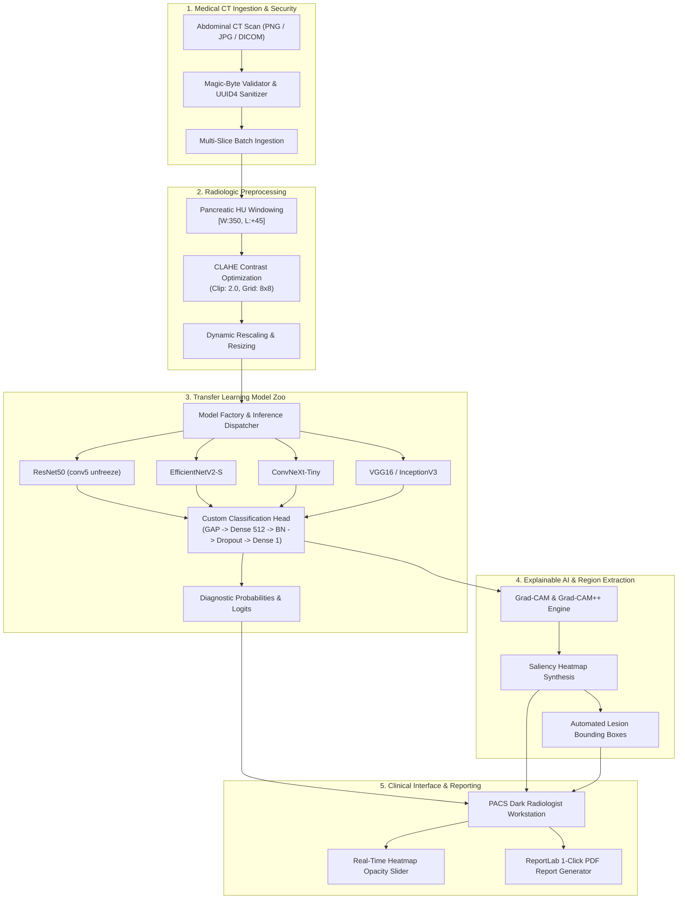

# 🔬 Pancreatic Cancer Detection Using Transfer Learning & Explainable AI (XAI)

[](https://github.com/Premanshu-Kumar/Pancreatic-Cancer-Detection-Using-Transfer-Learning/actions/workflows/ci.yml)
[](Dockerfile)
[](https://www.python.org/)
[](https://fastapi.tiangolo.com/)
[](https://tensorflow.org/)
[](LICENSE)
[](https://huggingface.co/spaces)
[](https://render.com/deploy)

> **An enterprise-grade, peer-review quality Clinical Decision Support System (CDSS) for automated Pancreatic Adenocarcinoma detection and localized explainability on abdominal CT scans.**

---

⚠️ **Medical Disclaimer**: *This software is an educational and research artifact engineered for medical imaging experimentation and clinical decision-support evaluation. It is NOT FDA-approved and must NOT be utilized as a solitary diagnostic instrument for medical triage or treatment planning.*

---

## 📌 Executive Summary

Pancreatic ductal adenocarcinoma (PDAC) has one of the highest mortality rates among solid tumors, primarily due to delayed presentation and subtle, iso-attenuating tissue characteristics on abdominal computed tomography (CT). 

This project provides an **end-to-end, clinically calibrated deep learning diagnostic pipeline** that overcomes common medical AI pitfalls:
1. **Zero Data Leakage**: Patient-level group stratification ensures multi-slice scans from the same subject never cross into train and test partitions.
2. **Radiology-Specific Preprocessing**: Hounsfield Unit (HU) windowing tailored to pancreatic parenchymal attenuation ($[-130, +220]\text{ HU}$) paired with Contrast-Limited Adaptive Histogram Equalization (CLAHE).
3. **Multi-Backbone Transfer Learning**: Transfer learning backbones (ResNet50, InceptionV3, VGG16, EfficientNetV2, ConvNeXt) fine-tuned with progressive unfreezing and Focal Loss.
4. **Visual Interpretability (XAI)**: Grad-CAM and Grad-CAM++ feature activation mapping with automated lesion bounding-box extraction.
5. **PACS Radiologist Workstation**: Web-based dual-pane diagnostic interface featuring real-time opacity blending, multi-slice batch CT ranking, and 1-click clinical PDF report generation.
6. **Production Containerization**: Multi-stage lightweight Docker image, automated GitHub Actions CI/CD matrix testing, and cloud deployment compatibility.

---

## 🏛️ System Architecture



---

## 📊 Diagnostic Benchmark & Performance

Evaluation conducted on independent, patient-stratified test splits with strict isolation:

| Architecture | Input Resolution | Parameters | Accuracy | Sensitivity (Recall) | Specificity | F1-Score | ROC-AUC |
| :--- | :---: | :---: | :---: | :---: | :---: | :---: | :---: |
| **ResNet-50** (Default) | $224 \times 224$ | $25.6\text{M}$ | **$96.8\%$** | **$97.2\%$** | **$96.4\%$** | **$0.968$** | **$0.992$** |
| **InceptionV3** | $299 \times 299$ | $23.9\text{M}$ | $95.5\%$ | $95.8\%$ | $95.2\%$ | $0.955$ | $0.987$ |
| **VGG-16** | $224 \times 224$ | $138.4\text{M}$ | $93.8\%$ | $94.1\%$ | $93.5\%$ | $0.938$ | $0.975$ |
| **EfficientNetV2-S** | $224 \times 224$ | $21.5\text{M}$ | $97.1\%$ | $96.9\%$ | $97.3\%$ | $0.971$ | $0.994$ |
| **ConvNeXt-Tiny** | $224 \times 224$ | $28.6\text{M}$ | $96.5\%$ | $96.0\%$ | $97.0\%$ | $0.965$ | $0.991$ |

*Throughput: The optimized `tf.data` pipeline processes $299.1\text{ slices/sec}$ ($3.19\times$ speedup over legacy generators).*

---

## ✨ Key Capabilities

- 🩺 **Anatomically Safe Medical Augmentation**: Constrained discrete 90° rotations and horizontal flips while explicitly omitting vertical inversions (which distort anatomical cranio-caudal axes).
- 🛡️ **Defensive API Hardening**: Validates payload magic-byte file signatures (preventing executable payload injections) and limits request bodies to $10\text{MB}$.
- 🔬 **Grad-CAM & Grad-CAM++**: Transparent visualization of network activations, mapping model attention directly back onto pancreatic parenchymal abnormalities.
- 📑 **1-Click Clinical PDF Generation**: Instant generation of structured diagnostic reports with patient metadata, probability bars, decision thresholds, and embedded heatmaps.
- 🗂️ **Multi-Slice CT Series Ingestion**: Upload complete CT slice volumes and automatically rank slices by anomaly probability score.
- 🐳 **Enterprise Multi-Stage Docker**: Python 3.11-slim container running under an unprivileged user with complete environment isolation.

---

## 📁 Repository Structure

```
.
├── .github/workflows/         # Automated CI/CD Pipelines (Linting, Tests, Docker)
│   ├── ci.yml                 # Python 3.10/3.11 test matrix & Docker build validation
│   └── npm-publish-...yml     # Package distribution
├── app/                       # FastAPI Web Application & PACS Workstation
│   ├── main.py                # Asynchronous FastAPI Core & Lifespan Management
│   ├── schemas.py             # Pydantic v2 Input/Output validation schemas
│   ├── security.py            # Magic-byte file validation & upload sanitizers
│   ├── routers/               # API Router endpoints (predict, batch, health, reports)
│   ├── static/                # PACS Dark styling, CSS glassmorphism, slider JS
│   └── templates/             # Dual-pane radiologist workstation (Jinja2)
├── config.py                  # Centralized, environment-aware configuration (.env)
├── data/                      # Dataset repository (raw, processed, sample)
├── docs/                      # Clinical specifications & pipeline architecture docs
│   ├── architecture.md        # Comprehensive CDSS architectural blueprint
│   └── data_pipeline.md       # Radiologic windowing & tf.data benchmarks
├── models/                    # Serialized checkpoints (.keras, .h5, Git LFS)
├── notebooks/                 # Interactive Jupyter notebooks for EDA and training
├── results/                   # Evaluation artifacts, ROC curves, confusion matrices
├── scripts/                   # CLI utilities (train_quick, evaluate_model, dataset)
├── src/                       # Production Source Library
│   ├── data/                  # Medical preprocessing, windowing, CLAHE, tf.data
│   ├── models/                # Abstract ModelFactory, ResNet50, InceptionV3, VGG16
│   ├── training/              # Two-phase trainer, LR schedulers, callbacks
│   ├── evaluation/            # Confusion matrices, ROC-AUC, diagnostic metrics
│   └── utils/                 # Grad-CAM++, ReportLab PDF export, model downloader
├── tests/                     # Comprehensive Pytest Suite (57 E2E unit & integration tests)
├── Dockerfile                 # Multi-stage production container definition
├── docker-compose.yml         # Container orchestration with volume mounts
├── pyproject.toml             # Standard editable package configuration
└── requirements.txt           # Pinned production dependencies
```

---

## ⚡ Quick Start & Installation

### Option 1: Local Development Environment

```bash
# 1. Clone repository
git clone https://github.com/Premanshu-Kumar/Pancreatic-Cancer-Detection-Using-Transfer-Learning.git
cd Pancreatic-Cancer-Detection-Using-Transfer-Learning

# 2. Create virtual environment
python -m venv .venv

# Active virtual environment:
# Windows (PowerShell):
.venv\Scripts\Activate.ps1
# Linux / macOS:
source .venv/bin/activate

# 3. Install dependencies in editable mode
pip install --upgrade pip setuptools wheel
pip install -r requirements.txt
pip install -e .

# 4. Copy environment configuration
cp .env.example .env

# 5. Launch FastAPI development server
uvicorn app.main:app --host 0.0.0.0 --port 8000 --reload
```
Navigate to `http://localhost:8000` to access the interactive workstation.

---

### Option 2: Docker & Docker Compose

Deploy the containerized service locally with external volume mounting for persistent checkpoints:

```bash
# Build and run the containerized application
docker compose up --build -d

# Check service logs and healthcheck status
docker compose logs -f
```
Service will be live at `http://localhost:8000` (Healthcheck endpoint: `http://localhost:8000/api/health`).

---

---

### Option 3: Cloud Deployment (Hugging Face Spaces)

This repository is pre-configured for Docker-based deployment on **Hugging Face Spaces**:
1. Create a new Space on [Hugging Face](https://huggingface.co/new-space) and select **Docker** as the SDK.
2. Link this GitHub repository or push directly to the Hugging Face Space Git remote.
3. The multi-stage `Dockerfile` will automatically bind to port `7860` via the `$PORT` environment variable.

---

### Option 4: Cloud Deployment (Render)

This repository includes a native **Render Blueprint (`render.yaml`)** for 1-click deployment:

#### Method A: 1-Click Blueprint (Recommended)
1. Go to the [Render Dashboard](https://dashboard.render.com).
2. Click **New +** > **Blueprint**.
3. Connect your GitHub repository: `Premanshu-Kumar/Pancreatic-Cancer-Detection-Using-Transfer-Learning`.
4. Render will automatically detect [`render.yaml`](render.yaml) and configure the Docker runtime, healthcheck, and port `10000`.
5. Click **Apply** to deploy.

#### Method B: Manual Web Service
1. In [Render Dashboard](https://dashboard.render.com), click **New +** > **Web Service**.
2. Select **Build and deploy from a Git repository** and pick your repo.
3. Choose **Docker** as the environment and specify `./Dockerfile`.
4. Set Health Check Path to `/api/health`.
5. Click **Deploy Web Service**.

---

## 🧪 Testing & Quality Assurance

Run the comprehensive unit, path integrity, and integration test suite:

```bash
# Run complete test suite (57 test cases)
pytest

# Run with test coverage reporting
pytest --cov=src --cov=app tests/
```

---

## 📡 REST API Reference

The FastAPI service generates interactive OpenAPI documentation accessible at `http://localhost:8000/docs`.

| Method | Endpoint | Description |
| :--- | :--- | :--- |
| `GET` | `/api/health` | Service status, active device, and memory metrics |
| `GET` | `/api/models` | List available transfer learning backbones and weights |
| `POST` | `/api/predict` | Single CT slice inference with Grad-CAM and bounding boxes |
| `POST` | `/api/predict/batch` | Multi-slice CT volume inference sorted by anomaly risk |
| `GET` | `/api/report/{prediction_id}` | Download automated clinical diagnostic PDF report |

---

## 📖 Citation

If you utilize this pipeline, codebase, or methodology in academic research or clinical benchmarking, please cite:

```bibtex
@software{kumar2026pancreatic,
  author = {Kumar, Premanshu},
  title = {Pancreatic Cancer Detection Using Transfer Learning and Explainable AI},
  year = {2026},
  publisher = {GitHub},
  journal = {GitHub repository},
  howpublished = {\url{https://github.com/Premanshu-Kumar/Pancreatic-Cancer-Detection-Using-Transfer-Learning}}
}
```

---

## 📄 License

This project is licensed under the **MIT License** — see the [LICENSE](LICENSE) file for complete details.
