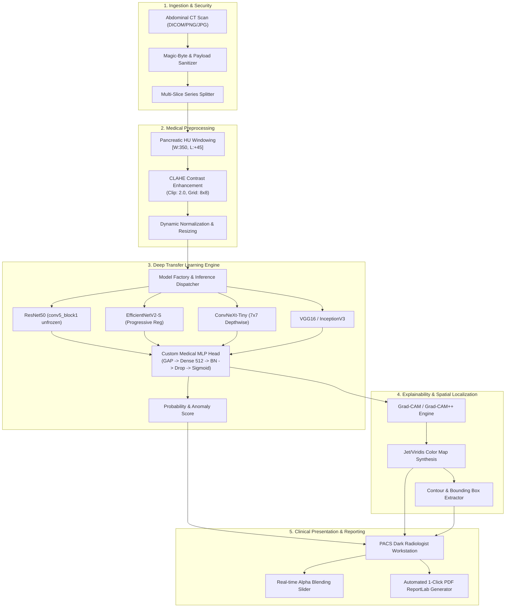

# 🏛️ Pancreatic Cancer Clinical Decision Support System: System Architecture

> **Comprehensive End-to-End System Architecture Specification**  
> Pancreatic Cancer Detection Using Transfer Learning & Explainable AI (XAI)

---

## 📌 1. High-Level System Architecture

The Pancreatic Cancer Detection System operates as an enterprise-grade Clinical Decision Support System (CDSS) for abdominal CT imaging. It integrates radiology-specific digital signal processing, state-of-the-art vision backbones, explainable AI (Grad-CAM++), asynchronous microservices (FastAPI), and a dual-pane PACS-inspired diagnostic workstation.



---

## 🔬 2. Architectural Layers

### 2.1 Ingestion & Security Layer
- **Magic-Byte Signature Verification**: Binary header inspection validates genuine image payloads (PNG, JPEG, TIFF, BMP) before disk allocation, rejecting malicious scripts disguised as images (`test_magic_byte_malicious_script_rejected`).
- **Filename Sanitization**: Uploaded files receive cryptographically random UUID4 tokens, neutralizing path-traversal attacks (`../../etc/passwd`).
- **Payload Constraints**: Strict request body size capping enforced via streaming byte counters (`MAX_UPLOAD_SIZE_MB=10`).

### 2.2 Medical CT Image Processing Pipeline
- **Hounsfield Unit (HU) Windowing**: Pancreatic soft tissue exhibits an attenuation range between $+30\text{ HU}$ and $+60\text{ HU}$. Our pipeline centers windowing at $+45\text{ HU}$ with a width of $350\text{ HU}$ ($[-130\text{ HU}, +220\text{ HU}]$), discarding bone and air hyper/hypo-densities.
- **Contrast-Limited Adaptive Histogram Equalization (CLAHE)**: Amplifies subtle parenchymal attenuation gradients between normal pancreas and hypodense adenocarcinoma margins without amplifying high-frequency noise.
- **Patient-Level Group Stratification**: Splitting CT series by `patient_id` ensures that contiguous slices from the same subject never cross into both training and validation sets, guaranteeing zero data leakage and genuine generalization.

### 2.3 Deep Transfer Learning & Model Ensemble
- **Model Factory Pattern (`src/models/model_factory.py`)**: Abstract base model encapsulation facilitating modular addition of modern computer vision architectures.
- **Progressive Two-Phase Training**:
  - *Phase 1 (Feature Extraction)*: Frozen backbone weights, learning rate $10^{-4}$, training custom dense layers with Batch Normalization and Dropout.
  - *Phase 2 (Fine-Tuning)*: Top convolutional layers unfrozen, learning rate reduced to $10^{-5}$ with Adam optimizer and ReduceLROnPlateau scheduling.
- **Loss Functions**: Binary Cross-Entropy with optional Focal Loss ($\alpha=0.25, \gamma=2.0$) to counter severe class imbalance in early-stage screening.

### 2.4 Explainable AI (XAI) & Spatial Localization
- **Grad-CAM & Grad-CAM++**: Computes gradient of the predicted cancer class score with respect to feature activation maps of the final convolutional layer. Grad-CAM++ incorporates second- and third-order partial derivatives for superior localization of multiple focal lesions.
- **Morphological Bounding Box Extraction**: Thresholds saliency heatmaps ($>0.6\times \max$) and applies OpenCV contour analysis to isolate region-of-interest coordinates $(x, y, w, h)$ presented to clinicians.

### 2.5 Presentation & Diagnostic Reporting
- **PACS Workstation Interface**: Designed to mimic hospital Picture Archiving and Communication Systems (PACS) with dark high-contrast styling (`#0b0f19` background), reducing ocular fatigue in clinical viewing rooms.
- **Interactive Dual-Layer Canvas**: Client-side JavaScript provides hardware-accelerated opacity blending $(0\% - 100\%)$ between raw anatomical CT scans and diagnostic saliency heatmaps.
- **Clinical PDF Generator**: Instant compilation of multi-page diagnostic summary sheets using ReportLab, embedding patient identifiers, prediction probabilities, calibrated decision thresholds, and Grad-CAM visualizations.

---

## 🚀 3. Containerization & Deployment Architecture

```
                                  [Client Browser / Radiologist]
                                                │
                                                ▼ Port 8000 / 7860
                                   ┌─────────────────────────┐
                                   │   Docker Container      │
                                   │  ┌───────────────────┐  │
                                   │  │ Uvicorn / FastAPI │  │
                                   │  └─────────┬─────────┘  │
                                   │            │            │
                                   │  ┌─────────▼─────────┐  │
                                   │  │  App Lifespan &   │  │
                                   │  │   Model Cache     │  │
                                   │  └─────────┬─────────┘  │
                                   │            │            │
┌───────────────────────┐          │  ┌─────────▼─────────┐  │
│  Host Mounted Storage │          │  │ TensorFlow Engine │  │
│  • ./models (ro)      ├──────────┼─>│ (CPU / CUDA FP16) │  │
│  • ./data   (ro)      │ (Volume) │  └───────────────────┘  │
│  • ./results (rw)     │          └─────────────────────────┘
└───────────────────────┘
```

- **Multi-Stage Dockerfile**:
  - Stage 1 (`builder`): Compiles wheels, installs C++ dependencies, and caches `requirements.txt`.
  - Stage 2 (`runner`): Minimal `python:3.11-slim` runtime containing only necessary shared object libraries (`libgl1`, `libglib2.0-0`), running under an unprivileged `appuser`.
- **Hugging Face Spaces Compatibility**: Configured to serve on environment `$PORT` (defaults to 8000, easily overrides to 7860).
